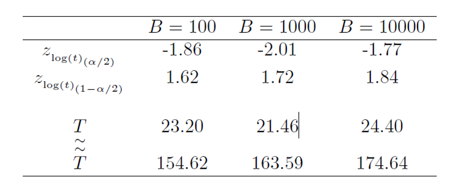

```{r echo=FALSE,message=FALSE, warning=FALSE}
source(jkf::SCRIPT('setup.R'))
library(SMRD)
```

# CHAPTER OVERVIEW

```{r}
shiny::includeCSS(jkf::SCRIPT('flat-slidy.css'))
shiny::includeScript(jkf::SCRIPT("jquery.min.js"))
shiny::includeScript(jkf::SCRIPT("jkf-scroll.js"))
```

## This chapter explains

- Important reliability-related applications of prediction

- The difference between probability prediction and statistical prediction

- Methods for computing predictions and prediction bounds for future failure times

- Methods for computing predictions and prediction bounds for the number of failures in a future time interval

# 12.1 - INTRODUCTION

#  12.1.1 - Motivation and prediction problems
 
#  12.1.2 - Model
 
#  12.1.3 - Data

# 12.2 - PROBABILITY PREDICTION INTERVALS ($\theta$ GIVEN)


# 12.3 - STATISTICAL PREDICTION INTERVAL ($\theta$ ESTIMATED)

# 12.3.1 - Coverage probability concepts

## Statistical predictions

- The objective of statistical prediction is to predict the value of some unknown, random quantity, e.g. $T$

- The prediction is based on 'learned' information from sample data $DATA$

- With sample data, there will be some inherent uncertainty in the estimated parameter values $\boldsymbol{\widehat{\theta}}$

- The estimated parameter values are then used to estimate a nominal prediction interval

$$PI(1-\alpha)=[\underset{\sim}{T}, \overset{\sim}{T}]$$

- Thus, the endpoints of the nominal prediction interval and the future random variable $T$ have a joint distribution, which depends on $\boldsymbol{\widehat{\theta}}$

## Coverage probability for prediction intervals with fixed $DATA$

- If the data are from single sample (fixed $DATA$)

    + The estimate of $\boldsymbol{\widehat{\theta}}$ is fixed
    + The endpoints of the prediction interval $[\underset{\sim}{T}, \overset{\sim}{T}]$ are also fixed

- The coverage probability for fixed $DATA$ is conditioned on the true, but unknown value of $\boldsymbol{\theta}$ and is expressed as

$$
\begin{aligned}
CP[PI(1-\alpha)|\boldsymbol{\widehat{\theta}};\boldsymbol{\theta}&=Pr(\underset{\sim}{T} \le T \le \overset{\sim}{T}|\boldsymbol{\widehat{\theta}};\boldsymbol{\theta})\\\\
&=F(\overset{\sim}{T};\boldsymbol{\theta})-F(\underset{\sim}{T};\boldsymbol{\theta})
\end{aligned}
$$

- However, this conditional coverage probability depends on how close $\boldsymbol{\widehat{\theta}}$ is to $\boldsymbol{\theta}$ 

- Thus, since the true value of $\boldsymbol{\theta}$ is unknown the coverage probability of a prediction interval based on fixed data is also unknown

## Coverage probability for prediction intervals with random $DATA$

- If the data are from multiple samples

    + The estimate of $\boldsymbol{\widehat{\theta}}$ is random as it varies with each sample
    + The endpoints of the prediction interval [\underset{\sim}{T}, \overset{\sim}{T}] are also random

- For each sample, the coverage probability is random and is conditioned on $\boldsymbol{\widehat{\theta}}$

- The unconditional coverage probability for the prediction interval _procedure_ is

$$
\begin{aligned}
CP[PI(1-\alpha)|\boldsymbol{\theta}&=Pr(\underset{\sim}{T} \le T \le \overset{\sim}{T}|;\boldsymbol{\theta})\\\\
&=E_{_{\boldsymbol{\widehat{\theta}}}}\left[CP[PI(1-\alpha)|\boldsymbol{\widehat{\theta}};\boldsymbol{\theta}\right]
\end{aligned}
$$

- The expectation in the above equation is taken wrt $\boldsymbol{\widehat{\theta}}$

- This unconditional coverage probability can be computed (approximately) and controlled

- Thus, this unconditional probability is generally used to describe a prediction interval procedure

- When $CP[PI(1-\alpha);\boldsymbol{\theta}]=1-\alpha$ does not depend on $\boldsymbol{\theta}$, the procedure is said to be 'exact'

- In general, the procedure is approximate because $CP[PI(1-\alpha);\boldsymbol{\theta}]\approx 1-\alpha$ depends on the unknown $\boldsymbol{\theta}$

# 12.3.2 - Relationship between 1-sided & 2-sided prediction intervals

## Equal Vs Unequal Prediction Intervals

- An equal-tailed $100(1-\alpha)\%$ probability prediction interval can be created by combining

    + A one-sided lower $100(1-\alpha/2)\%$ prediction bound where $Pr(0 < T \le \overset{\sim}{T})=1-\alpha/2$
    + A one-sided upper $100(1-\alpha/2)\%$ prediction bound where $Pr(\underset{\sim}{T} < T \le \infty)=1-\alpha/2$

- However, it may be possible to construct a narrower $100(1-\alpha)\%$ probability prediction interval with unequal probabilities in the upper and lower tails

- Equal-probability intervals have an advantage in that the endpoints can be correctly interpreted as the combination of one-sided bounds

- This is important as we are often interested in finding <u>either</u> the lower limit <u>or</u> the upper limit, but not both

# 12.3.3 - Naive method for computing a statistical prediction interval

## Naive prediction intervals

- Naive prediction intervals are obtained by substituting $\boldsymbol{\widehat{\theta}_{_{MLE}}}$ into equation 12.1

- For log-location scale distributions, this naive prediction interval is expressed as

$$
\begin{aligned}
PI(1-\alpha)&=\left[\underset{\sim}{T},\overset{\sim}{T}\right]\\\\
&=\left[\widehat{t}_{_{\alpha/2}},\widehat{t}_{_{1-\alpha/2}}\right]\\\\
&=\left[\exp\left(\widehat{\mu}_{_{MLE}}+\Phi^{-1}(\alpha/2)\times \widehat{\sigma}_{_{MLE}}\right),\quad\exp\left(\widehat{\mu}_{_{MLE}}+\Phi^{-1}(1-\alpha/2)\times \widehat{\sigma}_{_{MLE}}\right)\right]
\end{aligned}
$$

- The unconditional coverage probabilities for these naive prediction intervals 

    + Can be approximately equal to $1-\alpha$ for large sample sizes
    + Can fall far from $1-\alpha$ for small sample sizes

<div class='example'>
### Examples 12.2 & 12.3<br/>Naive prediction intervals (lognormal & Weibull distributions)

## Background

- Example 12.1 in which a prediction interval was produced for the time to failure of a ball bearing  

    + Investigated the `lzbearing` data set
    + Assumed lognormally distributed failure times and known parameter values 

- This example assumes that all observations greater than $80$ million cycles are right censored.

- Under this assumption, the data are

```{r, echo=TRUE}
example12_2 <- data.frame(cycles = c(lzbearing[1:15,],rep(80,8)), 
                          status = rep(c('fail','right'), c(15,8)))

example12_2
```

## Assuming lognormal distributed failures

- A lognormal probability plot of the data is shown below

```{r, echo=FALSE}
example12_2.ld <- frame.to.ld(example12_2,
                              response.column = 1,
                              censor.column = 2)

mleprobplot(example12_2.ld, 
            distribution = 'lognormal')
```

- The naive, two-sided $90\%$ prediction interval (assuming a lognormal distribution) is computed as

$$
\begin{aligned}
\left[\underset{\sim}{T},\overset{\sim}{T}\right]&=\left[\exp\left(\widehat{\mu}_{_{MLE}}+\Phi_{_{NOR}}^{-1}(0.05)\times \widehat{\sigma}_{_{MLE}}\right),
\quad\exp\left(\widehat{\mu}_{_{MLE}}+\Phi_{_{NOR}}^{-1}(0.95)\times \widehat{\sigma}_{_{MLE}}\right)\right]\\\\
&=\left[\exp\left(4.16+(-1.645)\times 0.5451\right),
\quad\exp\left(4.16+1.645\times 0.5451\right)\right]\\\\
&=[26.1, \quad 157.1]
\end{aligned}
$$

- Intervals constructed in this manner are generally too narrow

    + Ignore the uncertainty in $\widehat{\mu}$ and $\widehat{\sigma}$ relative to $\mu$ and $\sigma$
    + As result, the coverage probabilty is usually below the nominal value of $1-\alpha$ 

## Assuming Weibull distributed failures

- A Weibull probability plot of the data is shown below

```{r, echo=FALSE}
mleprobplot(example12_2.ld, 
            distribution = 'weibull')
```

- The naive, two-sided $90\%$ prediction interval (assuming a Weibull distribution) is computed as

$$
\begin{aligned}
\left[\underset{\sim}{T},\overset{\sim}{T}\right]&=\left[\exp\left(\widehat{\mu}_{_{MLE}}+\Phi_{_{SEV}}^{-1}(0.05)\times \widehat{\sigma}_{_{MLE}}\right),
\quad\exp\left(\widehat{\mu}_{_{MLE}}+\Phi_{_{SEV}}^{-1}(0.95)\times \widehat{\sigma}_{_{MLE}}\right)\right]\\\\
&=\left[\exp\left(4.334+(-2.970)\times 0.4013\right),
\quad\exp\left(4.334+1.097\times 0.4013\right)\right]\\\\
&=[23.2, \quad 118.4]
\end{aligned}
$$ 
</div>

# 12.4 - THE (APPROXIMATE) PIVOTAL METHOD FOR PREDICTION INTERVALS

## In this section

- Introduce basic ideas of pivotal methods

- Use pivotal methods to produce approximate prediction intervals for Type II (failure censored) data

- Use pivotal methods to produce approximate prediction intervals for Type I (time censored) data

## Pivotal Quantities vs. Statistics

- Recall, a __statistic__ is defined simply as a function of the data

- An __estimator__ is a type of statistic that is used to estimate the value of some unknown quantity

- Example statistics

    + The Kaplan-Meier Estimator $\prod_{i=1}^j 1-\frac{d_j}{n_j}$ is a statistic used to estimate the value of the survival function
    + The quantity $\sum_{i=1}^n \frac{x_i}{n}$ is a statistic that's a maximum likelihood estimator for the scale parameter in an exponential distribution
    + The value $\sqrt{log[\prod_{i=1}^n x^{4/3}_i]}$ is a statistic that may have no useful purpose at all

- Statistics <u>do not</u> depend on any unknown parameters

- By contrast, a __pivotal quantity__ (aka __pivot__) is a function of the data <u>and one or more unknown parameters</u>
    
    + Thus, a pivot is not a statistic
    + Pivots can be useful for constructing confidence and prediction intervals on the value of unknown parameters

#  12.4.1 - Type II (failure) censoring

## Background

- Type II failure tests conclude when $r$ failures have been observed, where $1 \le r \le n$

- The data from these tests are 

    + $r$ exact observations from the assumed underlying distribution
    + $n-r$ right censored observations from the assumed underlying distribution

- For Type II failure data (and complete data) the following quantity is pivotal - if $T$ has a log-location scale distribution

$$Z_{_{\log(T)}}=\frac{\log(T)-\widehat{\mu}}{\widehat{\sigma}}$$

- The distribution of $Z_{_{\log(T)}}$ depends only on the number of failures $r$ and the number of censored observation $n-r$, but does not depend on $\mu$ or $\sigma$

- Therefore, we can construct the following $100(1-\alpha)\%$ prediction interval

$$
Pr\left[z_{_{\log(T)_{(\alpha/2)}}} < \frac{\log(T)-\widehat{\mu}}{\widehat{\sigma}} \le z_{_{\log(T)_{(1-\alpha/2)}}}\right]=1-\alpha
$$

- Where $z_{_{\log(T)_{(p)}}}$ is the $p$ quantile of $Z_{_{\log(T)}}$

- Simplifying this inequality gives

$$
Pr\left[\widehat{\mu} + z_{_{\log(T)_{(\alpha/2)}}} \times \widehat{\sigma} < \log(T) \le \widehat{\mu} + z_{_{\log(T)_{(1-\alpha/2)}}}\times \widehat{\sigma} \right]=1-\alpha
$$

- Which results in the following prediction interval

$$
\left[\underset{\sim}{T},\overset{\sim}{T}\right]=\left[\exp\left(\widehat{\mu} + z_{_{\log(T)_{(\alpha/2)}}} \times \widehat{\sigma}\right), \quad  \exp\left(\widehat{\mu} + z_{_{\log(T)_{(1-\alpha/2)}}}\times \widehat{\sigma}\right) \right]
$$

## Obtaining values $z_{_{\log(T)_{(p)}}}$

- Type II failure data, will contain $r$ exact observations and $n-r$ right-censored observations

    + ML estimates $\widehat{\mu}_{_{MLE}}$ and $\widehat{\sigma}_{_{MLE}}$ can be produced using the observed data
    + However, the time at which the $r^{th}$ failure occurs is random quantity
    + The observed data provides just a small snapshot of the uncertainty that exists in the failure process
    + We can use bootstrapping to find the empirical distribution of $Z_{_{\log(T)}}$

## Bootstrapping procedure for $Z_{_{\log(T)}}$

- The steps below assume that

    + Collected Type II failure data with $r$ failures and $n-r$ right censored observations
    + $F(t|\widehat{\mu}_{_{MLE}}\widehat{\sigma}_{_{MLE}})$ has been determined from the collected data

- Steps to obtain the empirical distribution of $Z_{_{\log(T)}}$ using bootstrapping 

    1. Simulate $n$ observations from $F(t|\widehat{\mu}_{_{MLE}}, \widehat{\sigma}_{_{MLE}})$
    3. Order the simulated observations and set $t_{r+1},\cdots,t_n = t_r$
    4. Use the simulated data to determine $\widehat{\mu}^*_{_{MLE}}, \widehat{\sigma}^*_{_{MLE}}$
    5. Draw a single predicted observation, $T^*$, from $F(t|\widehat{\mu}_{_{MLE}}, \widehat{\sigma}_{_{MLE}})$
    6. Use the predicted observation to find $Z_{_{\log(T^*)}}=[\log(T^*)-\widehat{\mu}^*]/\widehat{\sigma}^*$
    6. Repeat the above steps to obtain $B$ observations of $Z_{_{\log(T^*)}}$
    6. Sort the $B$ observations and find the values in the positions $B\times\alpha/2$ and $B\times(1-\alpha/2)$
    6. Use these values to compute \left[\underset{\sim}{T}, \overset{\sim}{T}\right]

- Since the quantiles of $Z_{_{\log(T)}}$ depend only on $n$ and $r$, the coverage probability of the prediction interval will be exactly $1-\alpha$

#  12.4.2 - Type I (time) Censoring

## Background

- For Type I failure data, the distribution of $Z_{_{\log(T)}}$ depends on $n$ and $F(t_c,\boldsymbol{\theta})$ the proportion of units failing at the censoring time $t_c$ 

- However, in Type I tests the number of failures occurring at time $t_c$ depends on the unknown quantity $\boldsymbol{\theta}$

- Therefore, for Type I failure data the coverage probability of the prediction interval is only approximately equal to $1-\alpha$

- Probability prediction intervals for Type I failure data may be constructed using the same bootstrap procedure as was presented for Type II failure data

<div class='example'>
### Example 12.4<br/>Approximate prediction interval for ball bearing life

## Background

- This considers the censored `lzbearing` data from Examples 12.2 & 12.3 

```{r}
example12_2
```

- The goal of this example

    + Construct a two-sided $90\%$ probability prediction interval for failure time of a ball bearing
    + Based on the censored `lzbearing` data set
    + Using the approximate pivotal method
    + Assuming the underlying failure time distribution lognormal

## The Bootstrapping Process

- The bootstrap process described previously assumes that we can compute values for $\widehat{\mu}_{_{MLE}}$ and $\widehat{\sigma}_{_{MLE}}$

- From Example 12.2 we already know these values and can move forward

    + $\widehat{\mu}_{_{MLE}} = 4.16$
    + $\widehat{\sigma}_{_{MLE}} = 0.5451$

- Step 1) Draw a sample of size $n=23$ from $NOR(4.16,0.5451)$

```{r, echo=TRUE, results='markup'}
samp <- rlnorm(23, meanlog = 4.16, sdlog = 0.5451)
samp
```

- Step 2) Order the simulated observations and set $t_{r+1},\cdots,t_n = t_r$

```{r, echo=TRUE, results='markup'}
samp <- 
  sapply(X = seq_along(samp), 
         FUN = function(x) `if`(samp[x] >= 80, 80, samp[x]))
         
samp <- sort(samp)
```

- Step 3) Use the simulated data to determine $\widehat{\mu}^*_{_{MLE}}, \widehat{\sigma}^*_{_{MLE}}$

```{r, echo=TRUE, results='markup'}
fails <- sum(samp < 80)
right <- sum(samp == 80)
samp.df <- 
  data.frame(megacycles = samp,
             status = rep(c('fail','right'),c(fails,right)))
samp.df

samp.ld <- frame.to.ld(samp.df,
                       response.column = 1, 
                       censor.column = 2)
mlest <- print(mlest(samp.ld, distribution = 'lognormal'))

`mu*`    <- mlest$mle[1,1]
`sigma*` <- mlest$mle[2,1]

`mu*` ; `sigma*`
```

- Step 4) Draw a single predicted observation, $T^*$, from $F(t|\widehat{\mu}_{_{MLE}}, \widehat{\sigma}_{_{MLE}})$

```{r, echo=TRUE}
`T*` <- rlnorm(1, meanlog = 4.160, sdlog = 0.5451)
```

- Step 5) Use the predicted observation to find $Z_{_{\log(T^*)}}=[\log(T^*)-\widehat{\mu}^*]/\widehat{\sigma}^*$

```{r, echo=TRUE, results='markup'}
`Z_log[T*]` <- (log(`T*`) - `mu*`)/`sigma*`
`Z_log[T*]`
```

- Step 6) Repeat the above steps to obtain $B$ observations of $Z_{_{\log(T^*)}}$

```{r, eval=FALSE, echo=TRUE}
boot.pivot <- 
  function(B = 100, N = 23, 
           mu = 4.16, sigma = 0.5451, 
           t_c = 80, alpha = 0.10) 
{

samp <- replicate(B, rlnorm(N, mu, sigma))

samp <- apply(samp, MARGIN = 2, sort)

samp[which(samp > t_c)] <- t_c

params <- 
  sapply(X = 1:B, 
         FUN = function(x) {
           
      fails <- sum(samp[,x] < t_c)
      right <- N - fails
      samp.df <- 
        data.frame(samp[,x],
                   rep(c('f','r'),c(fails,right)))
      samp.ld <- 
        frame.to.ld(samp.df,
                    response.column = 1,
                    censor.column = 2)
      
      print(mlest(samp.ld, distribution = 'lognormal'))$mle[,1]
})

zlog_t <- 
  sapply(X = 1:B,
        FUN = function(x) { 
                        
    numer <- log(rlnorm(1, mu, sigma)) - params[[1,x]]
    denom <- params[[2,x]]
    numer / denom
})

zlog_t <- sort(zlog_t)

limits <- zlog_t[c(B * alpha / 2, B * (1 - alpha / 2))]

zout         <- list()
zout$zlog_t  <- zlog_t
zout$limits  <- limits 
zout$predict <- exp(mu + limits * sigma) 

return(zout)
}
```

<center>

</center>
</div>

# 12.5 - PREDICTION IN SIMPLE CASES

#  12.5.1 - Complete samples from a lognormal distribution
 

#  12.5.2 - Complete of Type II censored samples from an exponential distribution
 

# 12.6 - CALIBRATING NAIVE STATISTICAL PREDICTION BOUNDS

#  12.6.1 - Calibration by simulation of the sampling/prediction process
 

#  12.6.2 - Calibration by averaging conditional coverage probabilities
 

# 12.7 - PREDICTION OF FUTURE FAILURES FROM A SINGLE GROUP OF UNITS IN THE FIELD


# 12.8 - PREDICTION OF FUTURE FAILURES FROM MULTIPLE GROUPS WITH STAGGERED ENTRY

